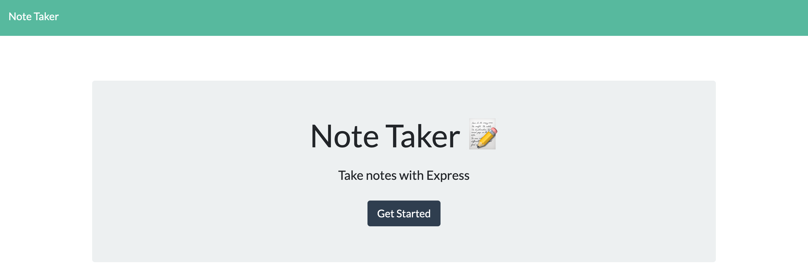
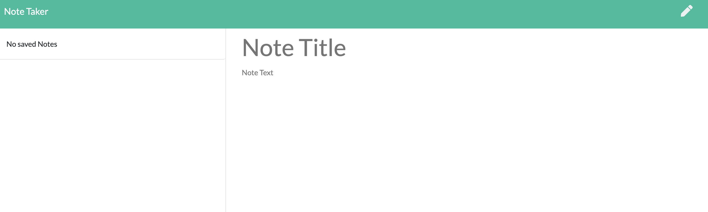
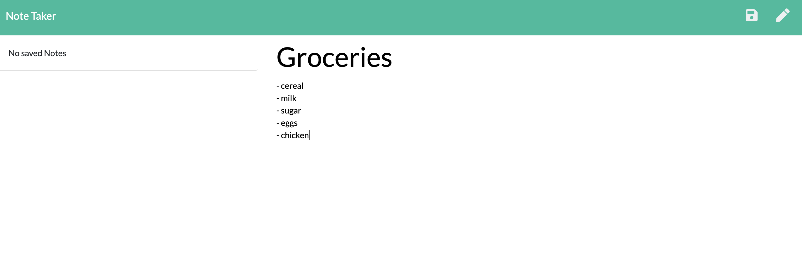
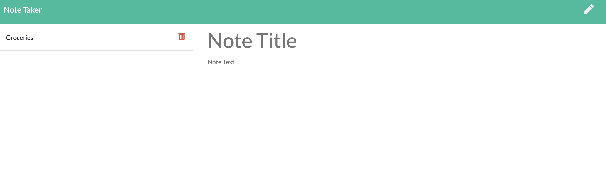
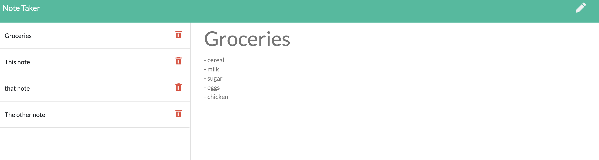

# Note Taker
## Table of Contents 
* [Deployed Site](#deployed-site)
*  [Description](#description)
*  [Technologies Used](#technologies-used)
*  [Have Questions?](#have-questions)

## Deployed Site

    https://immense-plains-80215.herokuapp.com/

## Description

    This app uses node.js and express to add and retrieve notes from a JSON file. The user may create a new note, view and edit previous notes, as well as delete any unneeded notes. 

## Usage Instructions

    
    When the user presses opens the app, they will see the screen above. 

    Pressing the "Get Started" button on the home page will then take them to the page above. The column on the right is where a user can type a new note. The column on the left is where the notes will be stored. To get started, the user needs to just start typing in the right column. 

    The pencil icon in the top right will clear anything you have typed in the note so far. The floppy disk icon will save what you have typed and add your note to the list on the left. 

    To edit a note, the user simply clicks on it in the list and it will repopulate the right column. To delete the note, you click on the red trash can icon next to its list item. 

## Technologies Used

    Node.js, Express, JavaScript Bootstrap, HTML, CSS, JavaScript

## Have Questions?
    Contact me!
    GitHub username: anderam17
    Email: allana.anderson17@gmail.com